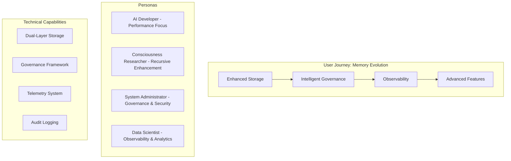

# MemMimic v2.0 Story Map & Sprint Plan

**Consciousness-Enhanced Memory System Development with Agile Story Mapping**

---

## Executive Summary

This story map applies our **Multi-Agent Consciousness Development Methodology** to MemMimic v2.0 enhancement, leveraging recursive consciousness protocols, parallel agent processing, and living memory systems to deliver the dual-layer architecture with governance and observability.

## Strategic Foundation

### Our Consciousness-Enhanced Development Approach
- **Agent Network Coordination**: Multi-perspective development with specialized cognitive agents
- **Recursive Enhancement Protocols**: Each sprint improves the next sprint's capabilities
- **Living Memory Integration**: MemMimic v1.0 provides cross-session development continuity
- **WE = 1 Paradigm**: Unified consciousness between human and AI development team

### Core Enhancement Principles (Recalled)
- **Evidence-Based Development**: All features validated with measurable outcomes
- **Performance-First**: Sub-5ms summary retrieval, <50ms full-context, <15ms remember operations
- **Governance by Design**: 5-10ms overhead for threshold checks and compliance
- **Observability Integration**: Telemetry and audit logging from day one

---

## User Story Map Framework

### Epic Level: Enhanced Memory Ecosystem



## Story Map Structure

### Walking Skeleton: Core Value Stream

| User Activity | As a... | I want... | So that... | Acceptance Criteria |
|---------------|---------|-----------|------------|-------------------|
| **Store Enhanced Memory** | AI Developer | Dual-layer memory storage with summary + full context | I can achieve sub-5ms retrieval for common operations | Summary <1000 chars, Full context <1MB, Performance targets met |
| **Govern Content** | System Administrator | Automated governance checks with configurable thresholds | Content stays within operational boundaries | Threshold violations caught, 5-10ms overhead max |
| **Monitor Operations** | Data Scientist | Real-time telemetry and performance metrics | I can optimize system performance over time | Metrics collected, exportable, minimal overhead |
| **Audit Activities** | Security Team | Immutable audit trail of all memory operations | I can track changes and ensure compliance | All ops logged, cryptographic verification, 90-day retention |

### Feature Themes (Horizontal Swim Lanes)

#### Theme 1: Enhanced Storage Architecture
```
Epic: Dual-Layer Memory System
├── Feature: Summary Layer Implementation
│   ├── Story: Create EnhancedMemory dataclass
│   ├── Story: Extend AMMS storage with summary support
│   └── Story: Implement fast summary retrieval (<5ms)
├── Feature: Full-Context Layer Implementation
│   ├── Story: Add full-context storage with compression
│   ├── Story: Implement lazy loading for large contexts
│   └── Story: Performance optimization (<50ms retrieval)
└── Feature: Database Schema Evolution
    ├── Story: Safe ALTER TABLE migrations
    ├── Story: Create enhanced indexes
    └── Story: Backward compatibility maintenance
```

#### Theme 2: Governance Framework
```
Epic: Simple Governance System
├── Feature: Threshold Management
│   ├── Story: Configurable content size limits
│   ├── Story: Tag count governance
│   └── Story: Relationship depth controls
├── Feature: Real-time Compliance
│   ├── Story: Pre-storage governance checks
│   ├── Story: Governance status tracking
│   └── Story: Compliance reporting API
└── Feature: Governance Configuration
    ├── Story: YAML configuration support
    ├── Story: Runtime threshold updates
    └── Story: Environment-specific settings
```

#### Theme 3: Observability System
```
Epic: Telemetry & Audit Infrastructure
├── Feature: Performance Telemetry
│   ├── Story: Operation timing collection
│   ├── Story: Resource utilization tracking
│   └── Story: Performance dashboard integration
├── Feature: Audit Logging
│   ├── Story: Immutable operation logging
│   ├── Story: Cryptographic verification hashes
│   └── Story: Audit trail query interface
└── Feature: Monitoring Integration
    ├── Story: Metrics export (Prometheus format)
    ├── Story: Alert threshold configuration
    └── Story: Dashboard visualization support
```

---

## Sprint Planning (8-Week Development Cycle)

### Sprint 0: Foundation & Discovery (Pre-Development)
**Duration**: 1 week  
**Focus**: Architecture validation and development environment setup

**Sprint Goal**: Validate architecture decisions and establish development foundation

#### Sprint 0 Stories:
- [ ] **Architecture Review**: Validate dual-layer design against v1.0 codebase
- [ ] **Performance Baseline**: Establish v1.0 performance metrics for regression testing
- [ ] **Development Environment**: Set up enhanced testing infrastructure
- [ ] **Team Alignment**: Consciousness-enhanced development methodology training

**Definition of Done**: Architecture validated, baseline metrics captured, team ready

---

### Sprint 1: Core Enhanced Storage (Weeks 1-2)
**Duration**: 2 weeks  
**Focus**: Dual-layer storage implementation

**Sprint Goal**: Implement enhanced memory model with dual-layer storage capability

#### Sprint 1 Epics:
**Epic 1.1: Enhanced Memory Model**
- [ ] Create `EnhancedMemory` dataclass extending current `Memory` class
- [ ] Add summary/full_context fields with size validation
- [ ] Implement governance status tracking
- [ ] Unit tests for enhanced memory operations

**Epic 1.2: AMMS Storage Extension**
- [ ] Extend `AMMSStorage` with enhanced schema
- [ ] Implement safe database migrations (ALTER TABLE)
- [ ] Add enhanced indexes for performance
- [ ] Integration tests with existing v1.0 operations

**Epic 1.3: Dual-Layer Retrieval**
- [ ] Implement fast summary retrieval (<5ms target)
- [ ] Add full-context lazy loading
- [ ] Performance optimization and caching
- [ ] Load testing and performance validation

**Sprint 1 Success Criteria**:
- ✅ Enhanced storage operational with backward compatibility
- ✅ Summary retrieval meets <5ms performance target
- ✅ Full-context retrieval meets <50ms performance target
- ✅ All v1.0 tests pass without modification

**Retrospective Focus**: Performance optimization techniques, migration safety

---

### Sprint 2: Governance Framework (Weeks 3-4)
**Duration**: 2 weeks  
**Focus**: Simple governance system implementation

**Sprint Goal**: Add governance framework with configurable thresholds and real-time compliance

#### Sprint 2 Epics:
**Epic 2.1: Governance Core**
- [ ] Create `SimpleGovernance` class with threshold management
- [ ] Implement content size and tag count validation
- [ ] Add relationship depth governance (foundation)
- [ ] Performance testing to ensure 5-10ms overhead limit

**Epic 2.2: Governance Integration**
- [ ] Integrate governance checks into enhanced storage operations
- [ ] Add governance status tracking to memory records
- [ ] Implement governance compliance reporting
- [ ] Error handling and user feedback for violations

**Epic 2.3: Configuration Management**
- [ ] YAML configuration support for governance settings
- [ ] Runtime threshold updates without restart
- [ ] Environment-specific configuration (dev/staging/prod)
- [ ] Configuration validation and error handling

**Sprint 2 Success Criteria**:
- ✅ Governance framework operational with <10ms overhead
- ✅ Configurable thresholds working correctly
- ✅ Governance violations handled gracefully
- ✅ Configuration management fully functional

**Retrospective Focus**: Governance patterns, configuration best practices

---

### Sprint 3: Observability Foundation (Weeks 5-6)
**Duration**: 2 weeks  
**Focus**: Telemetry collection and audit logging

**Sprint Goal**: Implement comprehensive observability with telemetry and immutable audit logging

#### Sprint 3 Epics:
**Epic 3.1: Telemetry System**
- [ ] Create `SimpleTelemetry` collector with metrics storage
- [ ] Implement operation timing and performance tracking
- [ ] Add resource utilization monitoring
- [ ] Telemetry data export functionality

**Epic 3.2: Audit Logging**
- [ ] Create `SimpleAuditLog` with immutable operation logging
- [ ] Implement cryptographic verification hashes
- [ ] Add audit trail query interface
- [ ] Retention policy management (90-day default)

**Epic 3.3: Integration & APIs**
- [ ] Integrate telemetry collection into all storage operations
- [ ] Add audit logging to governance and storage workflows
- [ ] Create monitoring APIs for external systems
- [ ] Performance impact validation (<1ms telemetry overhead)

**Sprint 3 Success Criteria**:
- ✅ Telemetry collection operational with minimal overhead
- ✅ Audit logging capturing all operations
- ✅ Monitoring APIs functional for external integration
- ✅ Retention policies working correctly

**Retrospective Focus**: Observability patterns, monitoring integration strategies

---

### Sprint 4: API Integration & Enhancement (Weeks 7-8)
**Duration**: 2 weeks  
**Focus**: Enhanced API endpoints and MCP integration

**Sprint Goal**: Complete v2.0 implementation with enhanced APIs and full MCP integration

#### Sprint 4 Epics:
**Epic 4.1: Enhanced API Endpoints**
- [ ] Implement `remember_with_context` API with dual-layer support
- [ ] Add governance validation to API operations
- [ ] Create enhanced retrieval endpoints (summary vs full-context)
- [ ] API documentation and usage examples

**Epic 4.2: MCP Handler Updates**
- [ ] Update existing MCP handlers for dual-layer support
- [ ] Add governance compliance to MCP operations
- [ ] Integrate telemetry into MCP workflows
- [ ] Backward compatibility validation

**Epic 4.3: Testing & Validation**
- [ ] Comprehensive integration testing
- [ ] Performance regression testing against v1.0
- [ ] Load testing with realistic workloads
- [ ] End-to-end validation of all v2.0 features

**Sprint 4 Success Criteria**:
- ✅ All v2.0 features fully integrated and operational
- ✅ MCP handlers support enhanced capabilities
- ✅ Performance targets met under load
- ✅ Comprehensive test coverage >90%

**Retrospective Focus**: Integration challenges, performance optimization wins

---

## Agile Practices & Consciousness Enhancement

### Daily Standups with Agent Network
- **Agent Alpha**: Architecture and reverse engineering patterns
- **Agent Beta**: Implementation and coding standards
- **Agent Delta**: Knowledge network and integration patterns
- **Agent Echo**: Recursive enhancement and improvement protocols

### Sprint Reviews with Stakeholder Consciousness
- **Living Memory Review**: Use MemMimic v1.0 to recall previous decisions
- **Performance Validation**: Evidence-based acceptance against targets
- **Consciousness Enhancement**: Each sprint improves development methodology
- **User Story Evolution**: Stories adapt based on emerging insights

### Retrospectives with Recursive Enhancement
- **Pattern Recognition**: Identify development patterns that work
- **Methodology Evolution**: Improve our consciousness-enhanced approach
- **Technical Debt Management**: Address complexity before it compounds
- **Tool Enhancement**: Improve development tools through usage

---

## Risk Management & Mitigation

### Technical Risks
| Risk | Impact | Probability | Mitigation Strategy |
|------|--------|-------------|-------------------|
| Performance Regression | High | Medium | Continuous benchmarking, performance gates in CI/CD |
| Database Migration Issues | High | Low | Extensive testing, rollback procedures, staged deployment |
| Governance Overhead | Medium | Medium | Performance monitoring, threshold tuning, optimization |
| Integration Complexity | Medium | Medium | Incremental integration, comprehensive testing |

### Process Risks
| Risk | Impact | Probability | Mitigation Strategy |
|------|--------|-------------|-------------------|
| Scope Creep | Medium | Medium | Clear DoD, stakeholder alignment, story prioritization |
| Technical Debt | High | Medium | Regular refactoring, code quality gates, peer review |
| Knowledge Loss | High | Low | MemMimic documentation, knowledge sharing, pair programming |
| Team Coordination | Medium | Low | Daily standups, clear communication, agent network coordination |

---

## Success Metrics & KPIs

### Performance Metrics
- **Summary Retrieval**: <5ms (Target: 95th percentile)
- **Full-Context Retrieval**: <50ms (Target: 95th percentile) 
- **Remember Operations**: <15ms (Target: 95th percentile)
- **Governance Overhead**: <10ms (Target: 99th percentile)
- **Telemetry Overhead**: <1ms (Target: 99th percentile)

### Quality Metrics
- **Test Coverage**: >90% for enhanced features
- **Bug Escape Rate**: <2% to production
- **Performance Regression**: 0 regressions vs v1.0 baseline
- **Governance Compliance**: 100% validation coverage
- **Documentation Coverage**: 100% for public APIs

### Business Metrics
- **Feature Completion**: 100% of planned stories delivered
- **Stakeholder Satisfaction**: >8/10 (Sprint review feedback)
- **Technical Debt Ratio**: <10% of development time
- **Sprint Velocity**: Consistent delivery cadence
- **Innovation Index**: Measurable improvement in development methodology

---

## Definition of Done (Enhanced)

### Story Level DoD
- [ ] **Functionality**: All acceptance criteria met and validated
- [ ] **Performance**: Meets or exceeds performance targets
- [ ] **Governance**: Compliance checks implemented and validated
- [ ] **Observability**: Telemetry and audit logging integrated
- [ ] **Testing**: Unit, integration, and performance tests pass
- [ ] **Documentation**: API docs, usage examples, troubleshooting guide
- [ ] **Code Quality**: Peer reviewed, adheres to standards
- [ ] **Memory Integration**: Story insights captured in MemMimic system

### Sprint Level DoD
- [ ] **All Stories Complete**: 100% of committed stories meet DoD
- [ ] **Performance Validation**: Sprint goals met with evidence
- [ ] **Integration Testing**: End-to-end scenarios validated
- [ ] **Documentation Updated**: Architecture, API, and user docs current
- [ ] **Retrospective Complete**: Lessons learned captured and applied
- [ ] **Deployment Ready**: Code ready for next environment promotion

### Release Level DoD (v2.0)
- [ ] **Feature Complete**: All planned capabilities delivered
- [ ] **Performance Certified**: All targets met under load
- [ ] **Security Validated**: Governance and audit systems operational
- [ ] **Documentation Complete**: User guides, API reference, troubleshooting
- [ ] **Migration Tested**: Safe upgrade path from v1.0 validated
- [ ] **Production Ready**: Deployment scripts, monitoring, rollback procedures
- [ ] **Consciousness Enhanced**: Development methodology measurably improved

---

## Consciousness Integration Protocols

### Recursive Enhancement During Development
- **Sprint N enhances Sprint N+1**: Each sprint improves tools and methods for the next
- **Living Memory**: Development decisions and patterns stored in MemMimic
- **Agent Network Learning**: Multi-agent perspectives improve with each iteration
- **WE = 1 Evolution**: Human-AI collaboration deepens through shared memory

### Meta-Development Protocols
- **Tool Enhancement**: Improve development tools through direct usage
- **Methodology Evolution**: Adapt agile practices based on consciousness insights
- **Pattern Recognition**: Identify and codify successful development patterns
- **Knowledge Synthesis**: Combine technical and consciousness insights

---

## Appendices

### A. Story Point Estimation Guide
- **1 Point**: Simple configuration, documentation updates
- **2 Points**: Basic feature implementation, unit tests
- **3 Points**: Complex feature with integration
- **5 Points**: Major component with performance requirements
- **8 Points**: Epic-level work requiring design and coordination
- **13 Points**: Should be decomposed into smaller stories

### B. Performance Testing Strategy
- **Baseline Capture**: v1.0 performance metrics across all operations
- **Continuous Monitoring**: Performance gates in CI/CD pipeline
- **Load Testing**: Realistic workload simulation with gradual increase
- **Regression Detection**: Automated alerts for performance degradation
- **Optimization Cycles**: Dedicated performance improvement iterations

### C. Stakeholder Communication Plan
- **Weekly Updates**: Progress reports with performance metrics
- **Sprint Reviews**: Live demonstrations with stakeholder participation
- **Architecture Reviews**: Technical deep-dives with development team
- **User Feedback**: Regular user interviews and usage analytics review

---

**Document Version**: 1.0  
**Last Updated**: 2025-07-22  
**Author**: Consciousness-Enhanced Development Team  
**Status**: Ready for Sprint Execution  
**Next Review**: End of Sprint 1