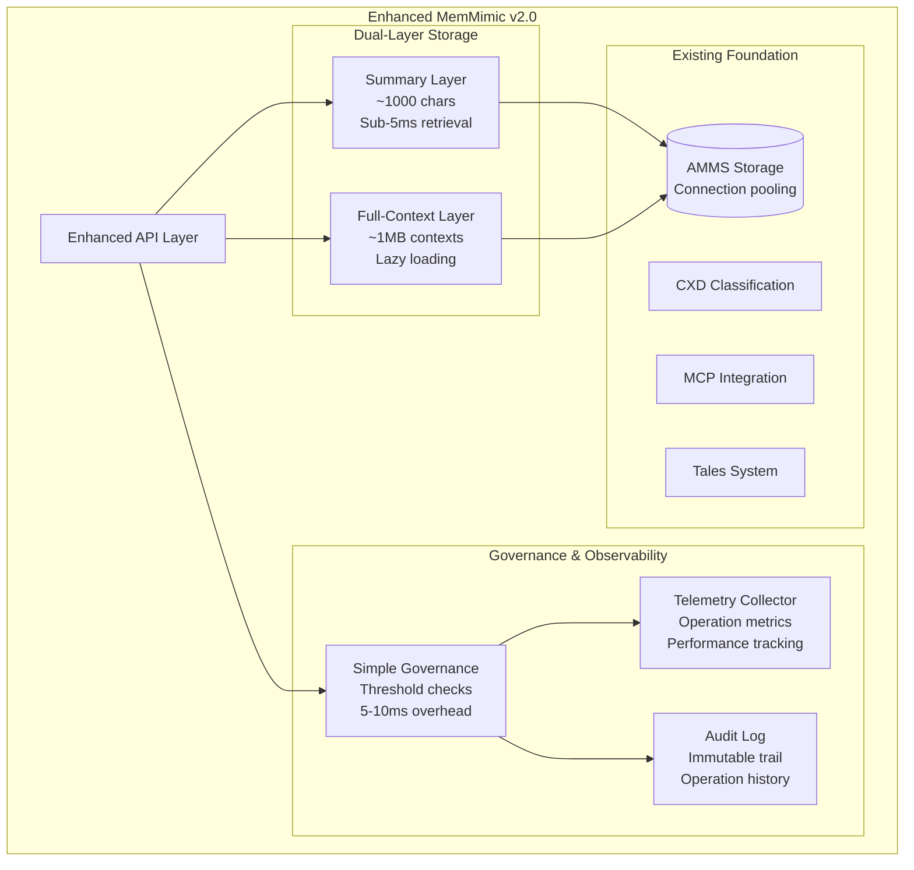

# MemMimic v2.0 Enhancement Proposal

**Enhanced Memory System with Dual-Layer Architecture, Governance, and Observability**

---

## Executive Summary

This proposal outlines a refined enhancement to MemMimic v1.0, incorporating complexity analysis to balance ambitious capabilities with engineering pragmatism. The enhancement introduces a dual-layer memory architecture, lightweight governance framework, and comprehensive observability—all while preserving the core AMMS performance characteristics and sub-100ms retrieval targets.

## Architecture Overview

### Current Foundation (v1.0)
- ✅ **AMMS Storage**: High-performance connection pooling with async operations
- ✅ **CXD Classification**: Advanced semantic classification system
- ✅ **MCP Integration**: 13 Python tools accessible via Node.js bridge
- ✅ **Tales System**: Narrative memory management
- ✅ **Security Framework**: Input validation, audit trails, error handling

### Enhanced Architecture (v2.0)



## Core Enhancements

### 1. Dual-Layer Memory Architecture

**Summary Layer**:
- **Purpose**: Lightning-fast retrieval for common operations
- **Size**: ~1000 characters per summary
- **Performance**: Sub-5ms retrieval target
- **Caching**: 30-minute TTL for frequently accessed summaries

**Full-Context Layer**:
- **Purpose**: Complete context for deep analysis
- **Size**: Up to 1MB per context
- **Performance**: <50ms retrieval with lazy loading
- **Compression**: Optional compression for storage efficiency

```yaml
enhanced_memmimic:
  storage:
    dual_layer_enabled: true
    summary_layer:
      max_size: 1000
      cache_ttl: 1800
    full_context_layer:
      max_size: 1000000
      compression_enabled: true
      lazy_loading: true
```

### 2. Simple Governance Framework

**Lightweight Threshold Checks**:
- Content size limits (1MB default)
- Tag count limits (100 tags default)  
- Relationship depth limits (3 levels default)
- **Performance Impact**: 5-10ms overhead per operation

**Governance Features**:
- Real-time compliance checking
- Configurable thresholds
- Governance status tracking
- Compliance reporting

```python
class SimpleGovernance:
    def check_content_governance(self, content: str, tags: List[str]) -> bool:
        return (
            len(content) <= self.thresholds['content_size'] and
            len(tags) <= self.thresholds['tag_count']
        )
```

### 3. Observability System

**Telemetry Collection**:
- Operation metrics (count, duration, success rate)
- Performance tracking (response times, throughput)
- Resource utilization monitoring
- Export interval: 1 hour default

**Audit Logging**:
- Immutable operation trail
- Cryptographic verification hashes
- 90-day retention default
- Memory-specific audit queries

```python
class SimpleTelemetry:
    def record_operation(self, operation: str, duration_ms: float, metadata: Dict[str, Any]):
        self.metrics[f"{operation}_count"] += 1
        self.timings.append({
            'operation': operation,
            'duration_ms': duration_ms,
            'timestamp': datetime.now().isoformat(),
            'metadata': metadata
        })
```

## Implementation Strategy

### Phase 1: Core Enhancement (Weeks 1-4)

#### 1.1 Enhanced Memory Model
```python
@dataclass
class EnhancedMemory(Memory):
    """Extended Memory with dual-layer support"""
    summary: Optional[str] = None
    full_context: Optional[str] = None
    tags: List[str] = field(default_factory=list)
    governance_status: str = "approved"
    context_size: int = 0
    tag_count: int = 0
```

#### 1.2 Enhanced AMMS Storage
- Extend existing `AMMSStorage` class
- Add new columns to memories table
- Implement dual-layer retrieval methods
- Maintain existing connection pooling performance

#### 1.3 Governance Module Implementation
```python
# src/memmimic/governance/__init__.py
class SimpleGovernance:
    def __init__(self, config: Dict[str, Any]):
        self.thresholds = config.get('thresholds', {
            'content_size': 1_000_000,
            'tag_count': 100,
            'relationship_depth': 3
        })
```

### Phase 2: API Integration (Weeks 5-6)

#### 2.1 Enhanced API Endpoints
```python
async def remember_with_context(
    self,
    summary: str,
    full_context: str,
    tags: List[str] = None,
    metadata: Dict[str, Any] = None
) -> str:
    # Governance check (5-10ms overhead)
    if not self.storage.governance.check_content_governance(full_context, tags or []):
        raise GovernanceError("Content exceeds governance thresholds")
    
    # Store with telemetry and audit logging
    memory_id = await self.storage.store_enhanced_memory(memory)
    
    return memory_id
```

#### 2.2 MCP Handler Updates
- Update existing MCP handlers to support dual-layer retrieval
- Add governance compliance checks to MCP operations
- Integrate telemetry collection into MCP workflows

### Phase 3: Testing and Validation (Weeks 7-8)

#### 3.1 Performance Validation
```python
async def test_governance_overhead(self):
    """Validate 5-10ms governance overhead"""
    start_time = time.perf_counter()
    await api.remember_with_context(summary, full_context, tags)
    duration = (time.perf_counter() - start_time) * 1000
    
    # Should be within existing performance + 5-10ms governance overhead
    assert duration < 20
```

#### 3.2 Integration Testing
- Comprehensive test suite for enhanced storage operations
- Performance regression testing against v1.0 baselines
- MCP integration validation with enhanced features

## Configuration Schema

```yaml
enhanced_memmimic:
  storage:
    dual_layer_enabled: true
    summary_layer:
      max_size: 1000
      cache_ttl: 1800
    full_context_layer:
      max_size: 1000000
      compression_enabled: true
      lazy_loading: true
  
  governance:
    enabled: true
    thresholds:
      content_size: 1000000
      tag_count: 100
      relationship_depth: 3
    
  telemetry:
    enabled: true
    metrics_retention: 30
    export_interval: 3600
    
  audit:
    log_level: "INFO"
    retention_days: 90
    immutable: true
```

## Performance Targets

| Operation | v1.0 Baseline | v2.0 Target | Notes |
|-----------|---------------|-------------|-------|
| Summary Retrieval | ~5ms | <5ms | Maintain current performance |
| Full Context Retrieval | N/A | <50ms | New capability |
| Remember Operation | ~5ms | <15ms | +5-10ms governance overhead |
| Governance Check | N/A | <10ms | New validation layer |
| Telemetry Recording | N/A | <1ms | Minimal overhead |

## Risk Mitigation

### Technical Risks
- **Performance Regression**: Comprehensive benchmarking against v1.0
- **Storage Overhead**: Monitor storage growth with compression options
- **Complexity Creep**: Strict adherence to simplified design principles

### Implementation Risks  
- **Database Migration**: Safe ALTER TABLE operations with rollback capability
- **API Compatibility**: Maintain backward compatibility for existing MCP handlers
- **Testing Coverage**: Achieve >90% test coverage for enhanced features

## Success Criteria

### Phase 1 Success Metrics
- ✅ Enhanced storage implementation with <15ms remember operations
- ✅ Governance module with configurable thresholds
- ✅ All existing tests pass without modification
- ✅ Database migration completes successfully

### Phase 2 Success Metrics
- ✅ Enhanced API endpoints operational
- ✅ MCP handlers support dual-layer retrieval
- ✅ Telemetry and audit systems collecting data
- ✅ Performance targets met under load testing

### Phase 3 Success Metrics
- ✅ Comprehensive test coverage (>90%)
- ✅ Performance regression tests pass
- ✅ Documentation complete and accurate
- ✅ Production deployment readiness confirmed

## Future Considerations

### Phase 4: Advanced Features (Future)
- **Relationship Tracking**: Simple parent-child relationships
- **Tag Evolution**: Basic timestamp-based change tracking  
- **Advanced Governance**: Custom governance rules and workflows
- **Enhanced Telemetry**: ML-based drift detection and alerting

### Deferred Complexity
The following features are explicitly **not** included in v2.0 to avoid over-engineering:
- ❌ Full graph relationship modeling (NetworkX dependency)
- ❌ Complex versioned tag histories
- ❌ Microservice architecture split
- ❌ Recursive self-modification capabilities
- ❌ Multi-graph dependency management

## Conclusion

This enhancement proposal provides a balanced approach to evolving MemMimic while preserving its core strengths. The dual-layer architecture addresses scalability concerns, the governance framework ensures responsible usage, and the observability system provides essential monitoring capabilities—all within acceptable performance boundaries.

The phased implementation approach allows for iterative validation and risk mitigation, ensuring that each enhancement delivers measurable value before proceeding to the next phase.

---

**Document Version**: 1.0  
**Last Updated**: 2025-07-22  
**Author**: MemMimic Development Team  
**Status**: Approved for Implementation