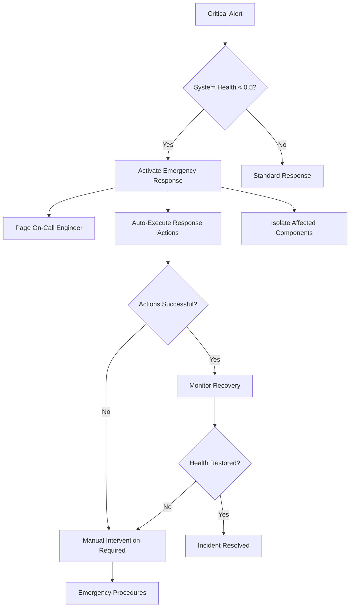

# MemMimic Enterprise Monitoring - Operational Runbook

This document provides comprehensive operational procedures for the MemMimic Enterprise Monitoring System, including incident response, troubleshooting, and maintenance tasks.

## Table of Contents

1. [System Overview](#system-overview)
2. [Quick Start](#quick-start)
3. [Monitoring Components](#monitoring-components)
4. [Alert Response Procedures](#alert-response-procedures)
5. [Incident Response Workflows](#incident-response-workflows)
6. [Troubleshooting Guide](#troubleshooting-guide)
7. [Maintenance Procedures](#maintenance-procedures)
8. [Performance Optimization](#performance-optimization)
9. [Emergency Procedures](#emergency-procedures)

## System Overview

The MemMimic Enterprise Monitoring System provides comprehensive observability with:

- **Real-time Metrics Collection**: Prometheus-compatible metrics for all components
- **Health Monitoring**: Automated health checks for critical services
- **Security Monitoring**: Threat detection and incident response
- **Intelligent Alerting**: Context-aware alerts with noise reduction
- **Interactive Dashboards**: Real-time monitoring interface
- **Automated Incident Response**: Self-healing capabilities

### Architecture Components

```
┌─────────────────┐    ┌─────────────────┐    ┌─────────────────┐
│ Metrics         │    │ Health          │    │ Security        │
│ Collector       │    │ Monitor         │    │ Monitor         │
└─────────────────┘    └─────────────────┘    └─────────────────┘
         │                       │                       │
         └───────────────────────┼───────────────────────┘
                                 │
         ┌─────────────────┐    │    ┌─────────────────┐
         │ Alert           │    │    │ Incident        │
         │ Manager         │    │    │ Response        │
         └─────────────────┘    │    └─────────────────┘
                                 │
                   ┌─────────────────┐
                   │ Dashboard       │
                   │ Server          │
                   └─────────────────┘
```

## Quick Start

### Starting the Monitoring System

```python
from memmimic.monitoring import MonitoringServer
from memmimic.api import create_memmimic

# Create MemMimic API instance
api = create_memmimic()

# Start monitoring server
server = MonitoringServer(api, dashboard_port=8080)
await server.start()

# Access dashboard at http://localhost:8080/dashboard
```

### Environment Variables

```bash
# Monitoring configuration
MEMMIMIC_DASHBOARD_PORT=8080
MEMMIMIC_DASHBOARD_HOST=0.0.0.0
MEMMIMIC_HEALTH_CHECK_INTERVAL=30
MEMMIMIC_ALERT_EVALUATION_INTERVAL=30
MEMMIMIC_METRICS_COLLECTION_INTERVAL=10

# Database configuration
MEMMIMIC_DB_PATH=/var/lib/memmimic/memmimic.db

# Alerting configuration
MEMMIMIC_ALERT_EMAIL=alerts@yourcompany.com
MEMMIMIC_ALERT_WEBHOOK=https://hooks.slack.com/services/YOUR/WEBHOOK/URL
```

## Monitoring Components

### 1. Metrics Collector

**Purpose**: Collects real-time performance and operational metrics

**Key Metrics**:
- `memmimic_memories_stored_total`: Total memories stored
- `memmimic_searches_total`: Total searches performed  
- `memmimic_cxd_classifications_total`: Total CXD classifications
- `memmimic_cache_hits_total`: Cache hits
- `memmimic_memory_usage_bytes`: Memory usage
- `memmimic_health_score`: Overall system health (0-1)

**Endpoints**:
- `/api/metrics`: JSON format metrics
- `/api/metrics/prometheus`: Prometheus format

### 2. Health Monitor

**Purpose**: Monitors health of critical system components

**Health Checks**:
- Database connectivity and performance
- Cache system operation
- Memory system functionality
- CXD classifier availability
- System resource utilization

**Status Levels**:
- `healthy`: All systems operational
- `degraded`: Some performance issues
- `unhealthy`: Significant problems
- `critical`: System failure imminent

### 3. Security Monitor

**Purpose**: Detects and responds to security threats

**Monitored Events**:
- Authentication failures
- Rate limit violations
- Injection attempts
- Suspicious IP activity
- Data access violations

**Threat Detection**:
- Brute force attack detection
- Anomalous behavior patterns
- Known attack signature matching

### 4. Alert Manager

**Purpose**: Manages alerting and notification routing

**Alert Severities**:
- `info`: Informational events
- `warning`: Issues requiring attention
- `error`: Problems affecting functionality
- `critical`: Immediate action required

### 5. Incident Response System

**Purpose**: Automates incident detection and response

**Response Actions**:
- Component restart
- Resource scaling
- Request throttling
- IP blocking
- Feature disabling
- Escalation to human operators

## Alert Response Procedures

### High Memory Usage Alert

**Alert**: `memmimic_memory_usage_percent > 80`

**Response Steps**:

1. **Immediate Assessment** (< 2 minutes)
   ```bash
   # Check current memory usage
   curl http://localhost:8080/api/metrics | jq '.metrics.gauges.memmimic_memory_usage_percent'
   
   # Check system health
   curl http://localhost:8080/api/health
   ```

2. **Identify Memory Consumers** (2-5 minutes)
   ```bash
   # Check cache size
   curl http://localhost:8080/api/metrics | jq '.metrics.gauges.memmimic_cache_size_bytes'
   
   # Check active database connections
   curl http://localhost:8080/api/metrics | jq '.metrics.gauges.memmimic_db_connections_active'
   ```

3. **Mitigation Actions** (5-10 minutes)
   - Clear non-essential caches
   - Restart memory-intensive components
   - Scale resources if available
   - Consider memory dump for analysis

4. **Prevention**
   - Review memory leak patterns
   - Adjust cache size limits
   - Implement memory monitoring alerts

### Database Performance Degradation

**Alert**: `memmimic_db_query_duration_seconds > 1.0`

**Response Steps**:

1. **Check Database Status** (< 1 minute)
   ```bash
   # Database health check
   curl http://localhost:8080/api/health | jq '.checks[] | select(.name=="database")'
   ```

2. **Analyze Query Performance** (2-5 minutes)
   ```bash
   # Check query metrics
   curl http://localhost:8080/api/metrics | grep db_query_duration
   
   # Check active connections
   curl http://localhost:8080/api/metrics | jq '.metrics.gauges.memmimic_db_connections_active'
   ```

3. **Immediate Actions**
   - Check for long-running queries
   - Verify database disk space
   - Monitor connection pool usage
   - Consider query optimization

4. **Escalation Criteria**
   - Query times > 5 seconds
   - Connection pool exhaustion
   - Database errors increasing
   - System health score < 0.5

### Security Incident Response

**Alert**: `injection_attempt` or `brute_force_attack`

**Response Steps**:

1. **Immediate Containment** (< 30 seconds)
   ```bash
   # Check security events
   curl http://localhost:8080/api/security | jq '.recent_events[0:5]'
   
   # Check active incidents
   curl http://localhost:8080/api/security | jq '.incidents'
   ```

2. **Threat Assessment** (1-3 minutes)
   - Identify attack source IPs
   - Determine attack vectors
   - Assess potential data exposure
   - Check for ongoing attacks

3. **Response Actions** (Automated)
   - IP blocking for repeat offenders
   - Rate limiting on affected endpoints
   - Feature disabling if necessary
   - Security team notification

4. **Investigation** (5-30 minutes)
   - Log analysis for attack patterns
   - System integrity verification
   - Data access audit
   - Incident documentation

## Incident Response Workflows

### Critical System Failure

**Severity**: Critical
**MTTR Target**: 15 minutes

**Workflow**:



### Performance Degradation

**Severity**: High
**MTTR Target**: 30 minutes

**Stages**:

1. **Detection** (0-2 minutes)
   - Automated alert triggered
   - Performance metrics analyzed
   - Impact assessment completed

2. **Diagnosis** (2-10 minutes)
   - Component health checks
   - Resource utilization review
   - Error rate analysis
   - Bottleneck identification

3. **Mitigation** (10-25 minutes)
   - Resource scaling
   - Cache optimization
   - Query optimization
   - Load balancing adjustment

4. **Recovery Verification** (25-30 minutes)
   - Performance metrics validation
   - User experience testing
   - Monitoring stabilization

### Security Breach

**Severity**: Critical
**MTTR Target**: 5 minutes (containment)

**Immediate Actions** (0-5 minutes):
1. Automated IP blocking
2. Feature isolation
3. Security team notification
4. Evidence preservation

**Investigation Phase** (5 minutes - 4 hours):
1. Attack vector analysis
2. System integrity verification
3. Data access audit
4. Vulnerability assessment

**Recovery Phase** (Variable):
1. System hardening
2. Security patch deployment
3. Monitoring enhancement
4. Process improvement

## Troubleshooting Guide

### Common Issues and Solutions

#### 1. Dashboard Not Loading

**Symptoms**:
- HTTP 500 errors on dashboard
- WebSocket connection failures
- Blank dashboard page

**Diagnostics**:
```bash
# Check dashboard server status
curl -I http://localhost:8080/dashboard

# Check logs
tail -f /var/log/memmimic/monitoring.log

# Verify component health
curl http://localhost:8080/api/status
```

**Solutions**:
1. Restart dashboard server
2. Check database connectivity
3. Verify port availability
4. Review configuration settings

#### 2. Metrics Not Updating

**Symptoms**:
- Stale metric values
- Missing metrics in Prometheus
- Dashboard showing old data

**Diagnostics**:
```bash
# Check metrics collector status
curl http://localhost:8080/api/metrics | jq '.timestamp'

# Verify background collection
ps aux | grep memmimic

# Check for collection errors
grep "metrics collection" /var/log/memmimic/monitoring.log
```

**Solutions**:
1. Restart metrics collector
2. Check system resources
3. Verify metric registration
4. Clear metric cache

#### 3. False Positive Alerts

**Symptoms**:
- Excessive alert notifications
- Alerts for non-issues
- Alert fatigue among operators

**Diagnostics**:
```bash
# Check alert rules
curl http://localhost:8080/api/alerts | jq '.alert_rules'

# Review alert history
curl http://localhost:8080/api/alerts | jq '.active_alerts'

# Analyze thresholds
grep "threshold" /var/log/memmimic/monitoring.log
```

**Solutions**:
1. Adjust alert thresholds
2. Implement alert suppression
3. Add context to alert conditions
4. Review alert correlations

#### 4. Performance Issues

**Symptoms**:
- Slow dashboard response
- High CPU usage
- Memory leaks

**Diagnostics**:
```bash
# Check system resources
curl http://localhost:8080/api/metrics | jq '.metrics.gauges | {cpu, memory, disk}'

# Monitor performance trends
curl http://localhost:8080/api/performance?hours=1

# Check for bottlenecks
top -p $(pgrep -f memmimic)
```

**Solutions**:
1. Optimize metric collection intervals
2. Reduce retention periods
3. Scale monitoring infrastructure
4. Implement performance caching

## Maintenance Procedures

### Daily Tasks

1. **Health Check Verification** (5 minutes)
   ```bash
   curl http://localhost:8080/api/health | jq '.status'
   ```

2. **Alert Review** (10 minutes)
   ```bash
   curl http://localhost:8080/api/alerts | jq '.summary'
   ```

3. **Performance Review** (10 minutes)
   ```bash
   curl http://localhost:8080/api/performance?hours=24
   ```

### Weekly Tasks

1. **Log Rotation** (15 minutes)
   ```bash
   logrotate /etc/logrotate.d/memmimic-monitoring
   ```

2. **Metric History Cleanup** (10 minutes)
   ```bash
   # Automated by retention policies
   curl http://localhost:8080/api/metrics | jq '.metrics_summary'
   ```

3. **Performance Baseline Update** (5 minutes)
   ```bash
   # Updates automatically based on recent performance
   curl http://localhost:8080/api/performance | jq '.baselines'
   ```

### Monthly Tasks

1. **Configuration Review** (30 minutes)
   - Alert rule effectiveness
   - Threshold appropriateness
   - Notification channel testing

2. **Capacity Planning** (45 minutes)
   - Resource usage trends
   - Growth projections
   - Infrastructure scaling needs

3. **Security Review** (60 minutes)
   - Security event analysis
   - Threat detection tuning
   - Incident response effectiveness

## Performance Optimization

### Monitoring System Optimization

1. **Metric Collection Tuning**
   ```python
   # Adjust collection intervals based on criticality
   CRITICAL_METRICS_INTERVAL = 10  # seconds
   STANDARD_METRICS_INTERVAL = 30  # seconds
   DETAILED_METRICS_INTERVAL = 60  # seconds
   ```

2. **Alert Optimization**
   - Implement intelligent thresholds
   - Use composite conditions
   - Add alert suppression during maintenance
   - Group related alerts

3. **Dashboard Performance**
   - Cache expensive queries
   - Implement progressive loading
   - Optimize WebSocket updates
   - Use metric aggregation

### MemMimic System Optimization

1. **Cache Performance**
   ```python
   # Monitor cache effectiveness
   hit_rate = cache_hits / (cache_hits + cache_misses)
   target_hit_rate = 0.85  # 85% target
   
   if hit_rate < target_hit_rate:
       # Increase cache size or optimize cache keys
       pass
   ```

2. **Search Performance**
   - Index optimization
   - Query result caching
   - Search result ranking tuning
   - Concurrent search limiting

3. **Database Performance**
   - Query optimization
   - Index management
   - Connection pool tuning
   - Archival strategies

## Emergency Procedures

### Complete System Failure

**Scenario**: All monitoring components offline

**Steps**:
1. **Switch to Manual Monitoring** (0-2 minutes)
   ```bash
   # Check system health manually
   ps aux | grep memmimic
   netstat -tlnp | grep 8080
   df -h
   free -h
   ```

2. **Emergency Restart** (2-5 minutes)
   ```bash
   # Stop all monitoring services
   pkill -f "memmimic.*monitoring"
   
   # Clear any locks or stale processes
   rm -f /tmp/memmimic-monitoring.lock
   
   # Restart monitoring system
   python -m memmimic.monitoring.monitoring_server
   ```

3. **Verify Recovery** (5-10 minutes)
   ```bash
   # Check dashboard accessibility
   curl -f http://localhost:8080/dashboard
   
   # Verify metrics collection
   curl http://localhost:8080/api/metrics | jq '.timestamp'
   
   # Confirm alert system
   curl http://localhost:8080/api/alerts | jq '.summary'
   ```

### Data Center Outage

**Scenario**: Primary infrastructure unavailable

**Steps**:
1. **Activate Disaster Recovery** (0-5 minutes)
   - Switch to backup monitoring infrastructure
   - Update DNS records
   - Notify stakeholders

2. **Restore Monitoring** (5-30 minutes)
   - Deploy monitoring stack to backup location
   - Restore metric history from backups
   - Reconfigure alert notifications

3. **Validate Operation** (30-60 minutes)
   - Test all monitoring functions
   - Verify alert delivery
   - Update operational procedures

### Security Compromise

**Scenario**: Monitoring system potentially compromised

**Steps**:
1. **Immediate Isolation** (0-2 minutes)
   ```bash
   # Disconnect from network
   iptables -A INPUT -j DROP
   iptables -A OUTPUT -j DROP
   ```

2. **Forensic Preservation** (2-10 minutes)
   ```bash
   # Preserve logs and data
   tar -czf /tmp/memmimic-forensics-$(date +%Y%m%d-%H%M%S).tar.gz \
       /var/log/memmimic/ \
       /var/lib/memmimic/ \
       /etc/memmimic/
   ```

3. **Clean Recovery** (10-60 minutes)
   - Deploy clean monitoring system
   - Restore from verified backups
   - Implement additional security controls
   - Conduct security audit

---

## Contact Information

**Emergency Contacts**:
- On-Call Engineer: +1-555-ONCALL
- Security Team: security@yourcompany.com
- Operations Manager: ops-manager@yourcompany.com

**Escalation Matrix**:
1. Level 1: Operations Team (0-15 minutes)
2. Level 2: Senior Engineers (15-30 minutes)
3. Level 3: Management (30+ minutes)

**Documentation Updates**:
- Runbook Repository: https://docs.company.com/memmimic/monitoring
- Change Management: ops-changes@yourcompany.com
- Training Materials: https://training.company.com/memmimic

---

*This runbook is maintained by the MemMimic Operations Team. Last updated: 2024-01-XX*